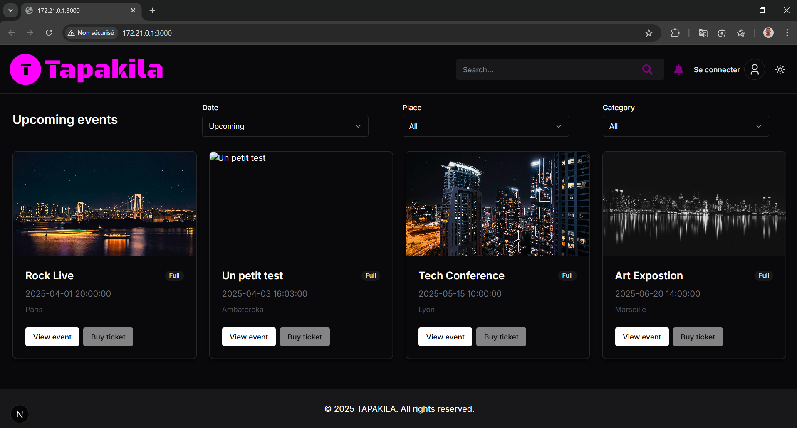

# Tapakila – Event Manager
Tapakila is a full-stack event ticketing system that allows users to browse events, book tickets, and manage their reservations. It features a public-facing website, an admin dashboard, and a RESTful backend API with role-based access control.

### Tech Stack
Frontend (Public Site): Next.js 15 (App Router)

Admin Dashboard: React-Admin

Backend: Node.js + Express, PostgreSQL, JWT authentication

### Key Features
- **Public Website :**

Event listings with filters and search

Dynamic event detail pages with ticket types 

Authenticated ticket booking process

User dashboard: view and cancel upcoming reservations

- **Admin Dashboard :**
Full CRUD on events, ticket types, and users

Role management (Admin, User)

Reservation monitoring and cancellation tools
